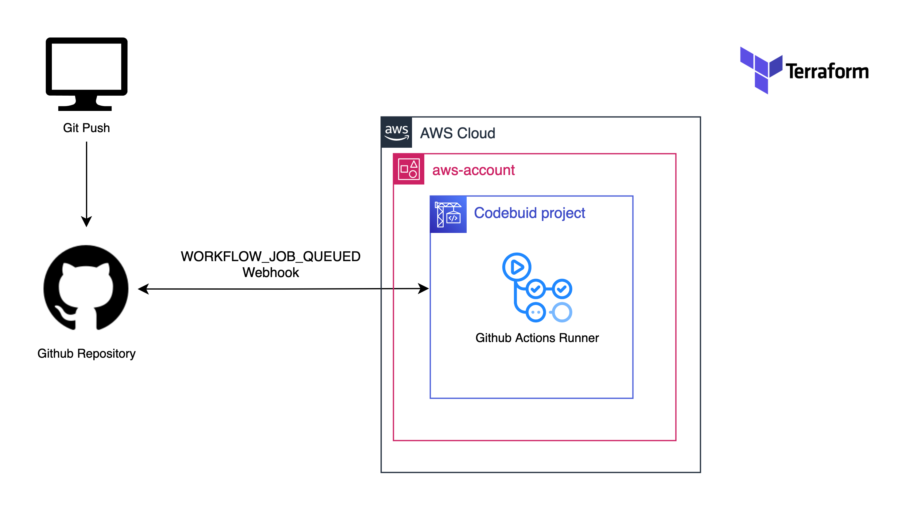

# Github Runner on AWS Codebuild

This sample demonstrates how to deploy and run Github runners with AWS Codebuild. More informations  [here](https://aws.amazon.com/fr/blogs/devops/aws-codebuild-managed-self-hosted-github-action-runners/). A workflow trigger is visible in the `Actions` of this repository.

## Prerequisites

1. Create a connexion between AWS and your github account/organization, to do this you need to go in the console `Developer Tools > Connections > Create connection`
2. Set the connexion as [the default connexion](https://eu-west-1.console.aws.amazon.com/codesuite/codebuild/sourceCredentials/default?provider=github&region=eu-west-1) `https://**your-region**.console.aws.amazon.com/codesuite/codebuild/sourceCredentials/default?provider=github&region=eu-west-1`
## Architecture diagram

Choosing a VPC is *optional*.
<!-- BEGIN_TF_DOCS -->

### Requirements

| Name                                                                      | Version  |
| ------------------------------------------------------------------------- | -------- |
|  [terraform](#requirement\_terraform) | >= 1.6.2 |
|  [aws](#requirement\_aws)                   | >=5.59.0 |

### Inputs

| Name                                                                  | Description                            | Type          | Default                                                           | Required |
| --------------------------------------------------------------------- | -------------------------------------- | ------------- | ----------------------------------------------------------------- | :------: |
|  [app\_env](#input\_app\_env)             | Environment name of the application.   | `string`      | `"test"`                                                          |    no    |
|  [app\_name](#input\_app\_name)          | Name of the application.               | `string`      | `"terraform-aws-codebuild-hosted-github-action-runner"`           |    no    |
|  [app\_owner](#input\_app\_owner)       | Owner of the application.              | `string`      | `"me"`                                                            |    no    |
|  [custom\_tags](#input\_custom\_tags) | A map of tags to add to all resources. | `map(string)` | `{}`                                                              |    no    |
|  [repo\_name](#input\_repo\_name)       | Name of the repository.                | `string`      | `"JulienQNN/terraform-aws-codebuild-hosted-github-action-runner"` |    no    |

<!-- END_TF_DOCS -->
<!-- BEGINNING OF PRE-COMMIT-TERRAFORM DOCS HOOK -->
README.md updated successfully
<!-- END OF PRE-COMMIT-TERRAFORM DOCS HOOK -->
